<div align="center">

# 📊 Pareto

### *The 80/20 Student Success Tool*

[](https://python.org)
[](https://fastapi.tiangolo.com/)
[](https://reactjs.org/)
[](https://vitejs.dev/)
[](https://tailwindcss.com/)
[](https://ai.google.dev/)

**Stop wasting time on low-impact assignments. Upload your syllabus and let AI optimize your semester.**

[Features](#-features) • [Installation](#-installation) • [Usage](#-usage) • [API Documentation](#-api-documentation) • [Contributing](#-contributing)

</div>

---

## 📑 Table of Contents

- [📊 Pareto](#-pareto)
  - [📑 Table of Contents](#-table-of-contents)
  - [🎯 About](#-about)
  - [✨ Features](#-features)
  - [🛠️ Tech Stack](#️-tech-stack)
  - [📋 Prerequisites](#-prerequisites)
  - [🚀 Installation](#-installation)
    - [1. Clone the Repository](#1-clone-the-repository)
    - [2. Backend Setup](#2-backend-setup)
    - [3. Frontend Setup](#3-frontend-setup)
    - [4. Quick Start (Both Servers)](#4-quick-start-both-servers)
  - [⚙️ Configuration](#️-configuration)
  - [📖 Usage](#-usage)
  - [📁 Project Structure](#-project-structure)
  - [🔌 API Documentation](#-api-documentation)
    - [Health Check](#health-check)
    - [Analyze Syllabus](#analyze-syllabus)
  - [🧠 How It Works](#-how-it-works)
  - [💡 Development Insights & Challenges](#-development-insights-&-challenges)
  - [🤝 Contributing](#-contributing)
  - [📄 License](#-license)
  - [🙏 Acknowledgments](#-acknowledgments)

---

## 🎯 About

**Pareto** is named after the [Pareto Principle](https://en.wikipedia.org/wiki/Pareto_principle) (also known as the 80/20 rule), which states that roughly 80% of consequences come from 20% of causes. 

In the context of academic success, this means that a significant portion of your grade often comes from just a few key assignments. Pareto helps students identify these high-impact assessments by intelligently analyzing course syllabi using AI.

> 🎓 **For Students, By Students** — Focus on what matters most and optimize your semester for maximum results with minimum effort.

---

## ✨ Features

| Feature | Description |
|---------|-------------|
| 📄 **PDF Syllabus Upload** | Simply drag and drop your syllabus PDF for instant analysis |
| 🤖 **AI-Powered Analysis** | Leverages Google Gemini 2.5 Flash for intelligent document parsing |
| 📊 **Smart Categorization** | Automatically categorizes assignments by impact and type |
| ⚖️ **Weight Analysis** | Identifies high-weight assignments that deserve your attention |
| 🎯 **Priority Sorting** | Ranks assignments by importance (mandatory → high-weight → droppable) |
| 📋 **Policy Extraction** | Extracts late policies, missed work rules, and grading scales |
| 💾 **Export Raw Data** | Download the full analysis as JSON for further use |
| ⚡ **Real-time Status** | See backend connection status and analysis duration |
| 🌙 **Modern Dark UI** | Beautiful, responsive interface with dark mode design |

### Assignment Categories

| Category | Badge | Description |
|----------|-------|-------------|
| **Mandatory** | 🔴 Red | Must complete to pass the course |
| **Transferable** | 🔵 Blue | Weight transfers to another assessment if missed |
| **Drop Rule** | 🟢 Green | Lowest N grades are automatically dropped |
| **Standard** | ⚪ Gray | Regular graded assignment |

---

## 🛠️ Tech Stack

### Backend
- **[FastAPI](https://fastapi.tiangolo.com/)** — Modern, fast Python web framework
- **[Google Generative AI](https://ai.google.dev/)** — Gemini 2.5 Flash for document analysis
- **[Pydantic](https://docs.pydantic.dev/)** — Data validation using Python type annotations
- **[Uvicorn](https://www.uvicorn.org/)** — Lightning-fast ASGI server

### Frontend
- **[React 19](https://react.dev/)** — UI component library
- **[Vite 7](https://vitejs.dev/)** — Next-generation frontend build tool
- **[Tailwind CSS 3.4](https://tailwindcss.com/)** — Utility-first CSS framework
- **[Axios](https://axios-http.com/)** — Promise-based HTTP client
- **[Lucide React](https://lucide.dev/)** — Beautiful & consistent icons

---

## 📋 Prerequisites

Before you begin, ensure you have the following installed:

| Requirement | Version | Installation |
|-------------|---------|--------------|
| **Python** | 3.8+ | [Download](https://python.org/downloads/) |
| **Node.js** | 18+ | [Download](https://nodejs.org/) |
| **npm** | 9+ | Included with Node.js |
| **Google Gemini API Key** | — | [Get API Key](https://makersuite.google.com/app/apikey) |

---

## 🚀 Installation

### 1. Clone the Repository

```bash
git clone https://github.com/SoroushRF/Pareto.git
cd Pareto
```

### 2. Backend Setup

```bash
# Navigate to backend directory
cd backend

# Create virtual environment (recommended)
python -m venv venv

# Activate virtual environment
# On macOS/Linux:
source venv/bin/activate
# On Windows:
venv\Scripts\activate

# Install dependencies
pip install -r requirements.txt
```

### 3. Frontend Setup

```bash
# Navigate to frontend directory (from project root)
cd frontend

# Install dependencies
npm install
```

### 4. Quick Start (Both Servers)

For convenience, you can start both servers simultaneously:

**On macOS/Linux:**
```bash
./run_dev.sh
```

**On Windows:**
```batch
run_dev.bat
```

**Or start them manually:**

Terminal 1 (Backend):
```bash
cd backend
uvicorn main:app --reload --port 8000
```

Terminal 2 (Frontend):
```bash
cd frontend
npm run dev
```

---

## ⚙️ Configuration

### Setting Up Your Gemini API Key

1. **Get your API key** from [Google AI Studio](https://makersuite.google.com/app/apikey)

2. **Create a `.env` file** in the `backend` directory:

```bash
cd backend
touch .env  # On Windows: type nul > .env
```

3. **Add your API key** to the `.env` file:

```env
GEMINI_API_KEY=your_api_key_here
```

> ⚠️ **Security Note:** Never commit your `.env` file to version control. It's already included in `.gitignore`.

---

## 📖 Usage

1. **Start the application** using one of the methods described in [Installation](#-installation)

2. **Open your browser** and navigate to:
   - Frontend: `http://localhost:5173`
   - Backend API: `http://localhost:8000`

3. **Upload your syllabus**:
   - Click "Select PDF" or drag and drop your syllabus file
   - Wait for the AI analysis (typically 10-30 seconds)

4. **Review the results**:
   - View categorized assignments sorted by importance
   - Check extracted policies (late work, missed assignments, etc.)
   - Download raw JSON data for further analysis

5. **Optimize your semester**:
   - Focus on **mandatory** (red) and **high-weight** assignments first
   - Take advantage of **drop rules** (green) for strategic planning
   - Understand **transferable** (blue) assessments for backup options

---

## 📁 Project Structure

```
Pareto/
├── 📁 backend/
│   ├── 📄 main.py              # FastAPI application & AI logic
│   ├── 📄 requirements.txt     # Python dependencies
│   └── 📄 .env                 # Environment variables (create this)
│
├── 📁 frontend/
│   ├── 📁 public/              # Static assets
│   ├── 📁 src/
│   │   ├── 📁 assets/          # Images and static files
│   │   ├── 📁 components/
│   │   │   ├── 📄 UploadZone.jsx       # File upload component
│   │   │   └── 📄 SyllabusDashboard.jsx # Results display
│   │   ├── 📄 App.jsx          # Main application component
│   │   ├── 📄 App.css          # Application styles
│   │   ├── 📄 main.jsx         # React entry point
│   │   └── 📄 index.css        # Global styles
│   ├── 📄 index.html           # HTML template
│   ├── 📄 package.json         # Node.js dependencies
│   ├── 📄 vite.config.js       # Vite configuration
│   ├── 📄 tailwind.config.js   # Tailwind CSS configuration
│   └── 📄 postcss.config.js    # PostCSS configuration
│
├── 📄 run_dev.sh               # Quick start script (Unix)
├── 📄 run_dev.bat              # Quick start script (Windows)
├── 📄 .gitignore               # Git ignore rules
└── 📄 README.md                # This file
```

---

## 🔌 API Documentation

The backend exposes a RESTful API for syllabus analysis.

### Health Check

```http
GET /
```

**Response:**
```json
{
  "status": "Pareto Backend Online"
}
```

### Analyze Syllabus

```http
POST /analyze
Content-Type: multipart/form-data
```

**Parameters:**

| Parameter | Type | Description |
|-----------|------|-------------|
| `file` | `file` | PDF file of the course syllabus |

**Response:**

```json
{
  "total_points": 100,
  "assignments": [
    {
      "name": "Final Exam",
      "weight": 40,
      "type": "strictly_mandatory",
      "details": {},
      "evidence": "Final exam is worth 40% of your grade...",
      "due_date": "Dec 15, 2025"
    },
    {
      "name": "Lab Reports",
      "weight": 20,
      "type": "internal_drop",
      "details": {
        "drop_count": 2,
        "total_items": 10
      },
      "evidence": "Lowest 2 lab reports will be dropped...",
      "due_date": null
    }
  ],
  "policies": [
    "Late Policy: 10% deduction per day",
    "Missed Work: Weight transfers to final exam"
  ],
  "raw_omniscient_json": { /* Full extracted data */ },
  "analysis_duration_seconds": 15.42
}
```

**Assignment Types:**

| Type | Description |
|------|-------------|
| `strictly_mandatory` | Must complete to pass |
| `external_transfer` | Weight can transfer to another assessment |
| `internal_drop` | Lowest N grades are dropped |
| `standard_graded` | Regular graded assignment |

---

## 🧠 How It Works

```mermaid
graph LR
    A[📄 Upload PDF] --> B[🔄 FastAPI Backend]
    B --> C[☁️ Google Gemini AI]
    C --> D[📊 Structured Analysis]
    D --> E[🎯 Priority Sorting]
    E --> F[📱 React Dashboard]
```



1. **Upload**: User uploads a syllabus PDF through the React frontend
2. **Processing**: FastAPI receives the file and uploads it to Google Gemini
3. **AI Analysis**: Gemini 2.5 Flash parses the document using a comprehensive prompt template
4. **Validation**: Pydantic models validate and structure the extracted data
5. **Optimization**: The backend categorizes and sorts assignments by importance
6. **Display**: Results are rendered in a beautiful, interactive dashboard

---


## 💡 Development Insights & Challenges

### The Gemini Prompt Engineering Hurdle

A significant technical hurdle in developing Pareto was constraining the generative output of Google's Gemini model to fit the application's structured data requirements. Initially, the model struggled to consistently classify assessment types (e.g., mandatory, droppable, transferable) across the diverse and often ambiguous language found in different syllabi.

The breakthrough came from a two-part strategy that blends **prompt engineering** with robust **backend validation:**

1.  **The "Omniscient" JSON Template:** Rather than asking the AI to simply find data, it was trained to fill out a meticulously designed JSON schema. This schema, defined in the `system_prompt` variable within `backend/main.py`, acts as a rigid template. It forces the model to structure its entire understanding of the syllabus into a predictable format, covering everything from grading mechanics to specific dates and policy details.

2.  **Pydantic Validation & Python Logic:** Once Gemini returns the completed JSON, the Python backend takes over. The `organize_syllabus_data` function leverages Pydantic models (such as `AssessmentComponent`, `GradingMechanic`, and the top-level `OmniscientSyllabus`) to validate the AI's output. This layer catches any structural errors and then transforms the complex, nested JSON into the clean, prioritized list required by the frontend. This experience of iteratively refining the prompt and data handling logic was a fantastic and practical introduction to AI engineering.

---

## 🤝 Contributing

Contributions are welcome! Here's how you can help:

1. **Fork the repository**
2. **Create a feature branch**
   ```bash
   git checkout -b feature/amazing-feature
   ```
3. **Commit your changes**
   ```bash
   git commit -m 'Add amazing feature'
   ```
4. **Push to the branch**
   ```bash
   git push origin feature/amazing-feature
   ```
5. **Open a Pull Request**

### Development Guidelines

- Follow existing code style and conventions
- Write meaningful commit messages
- Test your changes thoroughly
- Update documentation as needed

---

## 📄 License

This project is open source and available under the [MIT License](LICENSE).

---

## 🙏 Acknowledgments

- [Google Gemini](https://ai.google.dev/) for powerful AI capabilities
- [FastAPI](https://fastapi.tiangolo.com/) for the excellent Python framework
- [Vite](https://vitejs.dev/) for lightning-fast frontend tooling
- [Tailwind CSS](https://tailwindcss.com/) for beautiful styling utilities
- [Lucide](https://lucide.dev/) for the gorgeous icon set
- The [Pareto Principle](https://en.wikipedia.org/wiki/Pareto_principle) for the inspiration

---

<div align="center">

**Made with ❤️ for students everywhere**

*Focus on what matters. Achieve more with less.*

[](https://github.com/SoroushRF/Pareto)

</div>
